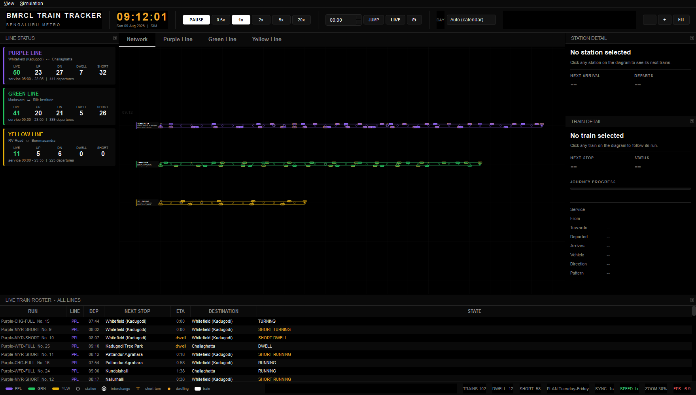
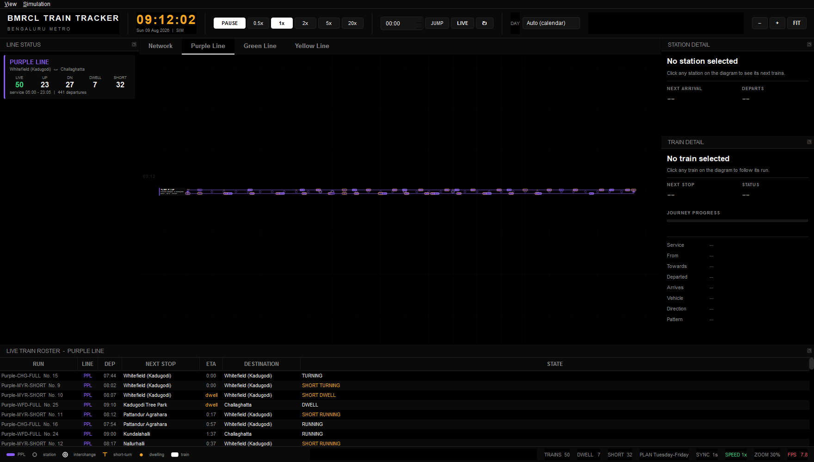
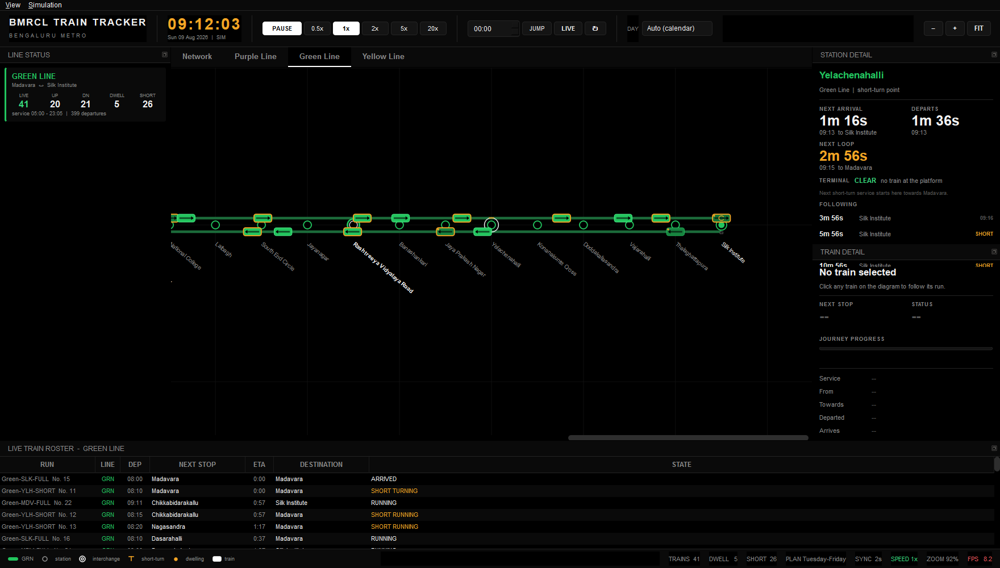
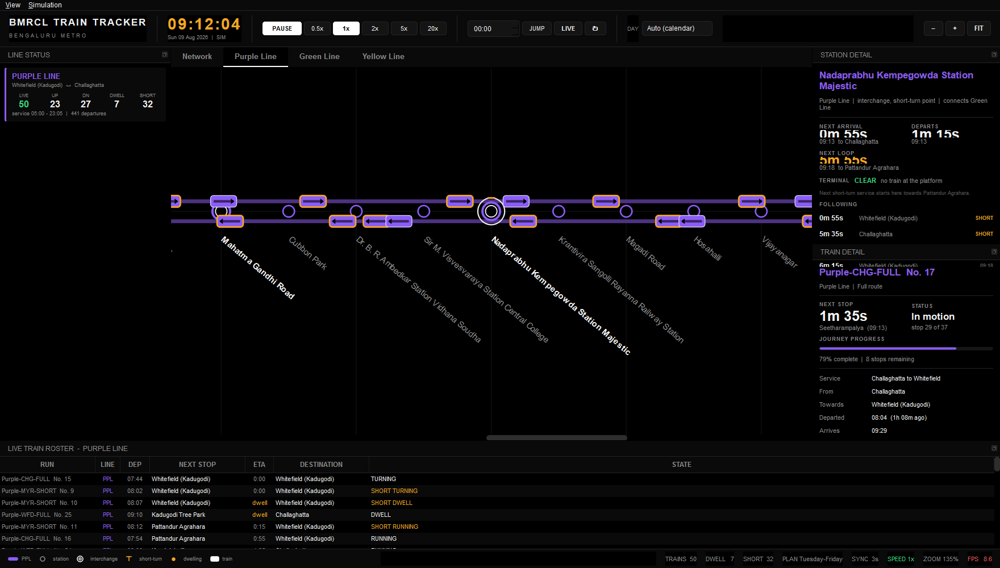

# BMRCL Train Tracker

[](https://github.com/SDlel/BMRCL-Train-Tracker/actions/workflows/ci.yml)


A desktop operations dashboard for the Bengaluru Metro network, built with
PySide6 and `QGraphicsScene`/`QGraphicsView`.



<sub>All three lines at the Tuesday to Friday morning peak. 98 trains in service.</sub>

<table>
<tr>
<td width="50%"></td>
<td width="50%"></td>
</tr>
<tr>
<td><sub><b>Line tab.</b> The whole dashboard scopes to one line: diagram, roster, counters and legend.</sub></td>
<td><sub><b>Station detail.</b> Yelachenahalli is a short-turn point, so it shows a third figure: when a service next turns back.</sub></td>
</tr>
</table>



<sub>Zoomed into the Purple Line core at Majestic. Up trains run above the axis,
down trains below. Interchanges are double rings, short-turn points carry an
amber tick.</sub>

---

## About this project

This is a hobby project. I have been interested in metro systems for a long
time, particularly in how they are operated rather than how they are used as a
passenger. Bengaluru Metro is the system I know best, so it seemed like the
natural place to start.

Most publicly available metro software is aimed at passengers: route planners,
fare calculators, live arrival apps. Very little of it shows the network the
way an operator would see it, with every train on every line visible at once.
That gap is what this project explores.

The interesting problems turned out to be less about drawing and more about
modelling. Published timetables give frequencies, not departure times, so the
schedule has to be expanded into individual runs. Trains that terminate part
way along a line have to be handled separately from trains running the full
route. Services that reverse at intermediate stations are two separate runs
rather than one train with a long stop. Working these out was the bulk of the
effort.

It is a simulation, not a live feed. There is no connection to any real signal
or train management system, and the timetable is transcribed from published
frequency tables rather than obtained from BMRCL. It is not affiliated with
BMRCL in any way.

---

## Glossary

Terms used throughout the interface and the documentation.

| Term | Meaning |
| --- | --- |
| **Dwell** | The time a train spends stationary at a platform with its doors open, letting passengers board and alight. Modelled here as 20 seconds at every intermediate station. |
| **Headway** | The time gap between one train and the next on the same route. A 5 minute headway means a train every 5 minutes. Published timetables usually give headways rather than individual departure times. |
| **Run time** | The time taken to travel between two adjacent stations, excluding dwell. Modelled here as 120 seconds. |
| **Short turn** | A service that runs only part of a line instead of end to end, used to add capacity on the busiest section. A Kempegowda to Pattandur Agrahara train on the Purple Line is a short turn. |
| **Short-turn point** | A station where a short-turn service can start or finish, because the track layout allows a train to change direction there. Marked with an amber tick on the diagram. |
| **Loop** | Used in this dashboard for the event of a service reversing at a short-turn point. One run terminates, and a separate run departs in the opposite direction. |
| **Terminus** | A station at the end of a line. Trains cannot continue past it. |
| **Terminating** | A train whose run finishes at the station in question. It does not depart again in service; it turns back as a different run with a different identifier. |
| **Interchange** | A station served by more than one line, where passengers can change between them. Drawn as a large double ring. |
| **Up and down** | Conventional railway terms for the two directions of travel. Here, up runs towards higher station indices and is drawn above the line axis; down runs the opposite way, below the axis. |
| **Turnaround** | The time a train occupies a terminal platform after arriving, before the platform is released. A simulation assumption, not published BMRCL data; 300 seconds by default, split into a 30 second arrival period and 270 seconds of turning. |
| **Depot** | A facility where trains are stabled and maintained. Stations with depot access are marked with a small square. |
| **Day type** | A grouping of days that share a timetable. This network uses four: Monday, Tuesday to Friday, Saturday and Sunday. |
| **Frequency window** | A period during which a given headway applies, for example 10 minute headways between 05:20 and 10:57. |

---

## Download and run

### Option 1: download a ready-made build

No Python needed. This is the easiest route.

Go to the [latest release](https://github.com/SDlel/BMRCL-Train-Tracker/releases/latest)
and download the file for your system from under **Assets**.

| System | File | Size |
| --- | --- | --- |
| Windows | `BMRCL-Train-Tracker-Windows.zip` | 48 MB |
| macOS | `BMRCL-Train-Tracker-macOS.zip` | 93 MB |
| Linux | `BMRCL-Train-Tracker-Linux.zip` | 114 MB |

Unzip the archive anywhere, then run the `BMRCL-Train-Tracker` executable
inside the folder.

Ignore the two "Source code" archives on that page. GitHub adds those to every
release automatically, and they contain the code rather than a runnable app.

The downloads are large because they bundle the Python runtime and the UI
toolkit, so nothing else has to be installed.

None of the builds are code-signed, so expect a warning on first launch. On Windows,
SmartScreen may say the publisher is unknown; choose **More info** then **Run
anyway**. On macOS, right-click the app and choose **Open** rather than
double-clicking.

### Option 2: run from source

Requires Python 3.12 or newer.

```bash
git clone https://github.com/SDlel/BMRCL-Train-Tracker
cd BMRCL-Train-Tracker
python -m pip install -r requirements.txt
python run.py
```

Or install it as a command:

```bash
pip install -e .
bmrcl-train-tracker
```

`python -m bmrcl` also works.

### Option 3: build your own executable

```bash
pip install -e ".[package]"
python package.py
```

The result lands in `dist/BMRCL-Train-Tracker/`. Builds are platform-specific,
so a Windows build must be produced on Windows.

### Verify the install

```bash
pip install -e ".[dev]"
python -m pytest        # 292 tests, about 50 s
python selftest.py      # end-to-end integration pass
```

---

## Controls

| Action | Control |
| --- | --- |
| Switch tab | Click, or `Ctrl+1` to `Ctrl+4` |
| Pause and resume | `Space`, or the **PAUSE** button |
| Simulation speed | `0.5x` `1x` `2x` `5x` `20x` buttons |
| Jump to a time | Time field plus **JUMP** |
| Return to real time | **LIVE**, or `Ctrl+L` |
| Refresh the clock | the refresh icon, or `F5` |
| Step 5 min or 1 hr | `←` `→` and `Ctrl+←` `Ctrl+→` |
| Day type | **DAY** dropdown (Auto, Monday, Tue-Fri, Saturday, Sunday) |
| Zoom | Mouse wheel, `+` and `−`, or the header buttons |
| Pan | Drag anywhere, or `Shift` plus wheel for horizontal |
| Fit whole network | `0`, or **FIT** |
| Inspect a station | Click a circle. Detail opens on the right. |
| Inspect a train | Click a train, or a row in the roster. Detail opens on the right. |

---

## Layout

```
┌──────────────────────────────────────────────────────────────┐
│ HEADER   brand │ clock │ transport │ time jump │ day │ zoom   │
├──────────────────────────────────────────────────────────────┤
│ [ Network ] [ Purple Line ] [ Green Line ] [ Yellow Line ]    │
├──────────┬───────────────────────────────────┬───────────────┤
│ LINE     │                                   │ STATION       │
│ STATUS   │  Purple ●─●─●────────────●─●─●    │ DETAIL        │
│          │  Green  ●─●─●──────●─●─●          │               │
│ live/up  │  Yellow ●─●─●──●─●                │ arrival       │
│ dn/dwell │                                   │ departure     │
│ / short  │  (up track above, down below)     │ loop          │
│          │                                   ├───────────────┤
│          │                                   │ TRAIN         │
│          │                                   │ DETAIL        │
├──────────┴───────────────────────────────────┴───────────────┤
│ LIVE TRAIN ROSTER   run │ line │ dep │ next │ eta │ dest      │
├──────────────────────────────────────────────────────────────┤
│ STATUS  legend │ trains │ dwell │ short │ plan │ speed │ fps  │
└──────────────────────────────────────────────────────────────┘
```

### Station detail

Click any station. The right-hand dock answers two questions at every station,
and a third at short-turn points.

| Tile | Shown at | Meaning |
| --- | --- | --- |
| **NEXT ARRIVAL** | every station | Countdown, clock time and destination |
| **DEPARTS** | every station | When that train leaves, being arrival plus the 20 second dwell |
| **NEXT LOOP** | short-turn points only | When a service next starts back from here |

A normal station such as Jayanagar shows two figures. A short-turn point such
as Yelachenahalli, Peenya Industry or Majestic shows three.

```
Yelachenahalli
Green Line  |  short-turn point
─────────────────────────────────────
NEXT ARRIVAL          DEPARTS
1m 18s                1m 38s
09:01 to Madavara     09:01

NEXT LOOP
4m 58s
09:05 to Madavara
A service terminates here and the next
working departs towards Madavara.

FOLLOWING
2m 58s   Silk Institute        SHORT
4m 58s   Silk Institute        09:05
7m 58s   Silk Institute        SHORT
```

A train that terminates at the station shows `terminates` instead of a
departure time, because it does not leave in service. It turns back as a
different run. That distinction is the reason the loop tile exists separately.

Countdowns update at 10 Hz, and the selected station is marked with a white
ring on the diagram in every tab that shows it.

### Train detail

Clicking a train opens its own panel directly beneath the station one, so the
right-hand column always answers whatever was last clicked.

```
Purple-WFD-FULL  No. 22
Purple Line  |  Full route
─────────────────────────────────────
NEXT STOP             STATUS
2m 00s                In motion
Kundalahalli (09:14)  stop 9 of 37

JOURNEY PROGRESS
████████░░░░░░░░░░░░░░░░░░░░░░░
24% complete  |  28 stops remaining

Service    Whitefield to Challaghatta
From       Whitefield (Kadugodi)
Towards    Challaghatta
Departed   08:41  (19 min ago)
Arrives    10:04
Direction  Up  (towards Challaghatta)
Pattern    Full route
```

The panel follows the run rather than freezing at the moment it was clicked.
It re-finds the train by its identifier on every refresh, so the countdown,
progress bar and next stop stay live as it moves. When the run finishes, the
panel says so instead of showing stale figures.

Up and Down are the conventional railway terms for the two directions, but
they mean nothing on their own, so the panel also names the end of the line
each direction heads towards.

### Keeping time accurate

Train positions are calculated from the clock rather than nudged forward each
frame, so a train can never drift out of step with its own timetable. The
clock itself is a different matter.

Every frame advances time by the interval measured since the previous frame.
Those measurements are rounded, and they are clamped when a frame stalls or
the window stops being painted, so the simulated clock slowly falls behind the
system clock. Measured at roughly 13 seconds per hour, with larger losses if
the machine is busy.

Two things correct it:

- **Automatic**, every 10 minutes. The clock is compared against system time
  and snapped back. Running state, speed and the selected day are preserved,
  so it never interrupts anything.
- **Manual**, via the refresh icon in the header or `F5`, which does the same
  immediately and shows the result on screen.

A brief confirmation appears over the diagram either way, reading `Refreshed
(+236ms)` or `Already in sync`, with the unit scaled to the size of the
correction. The status bar also shows how long ago the last sync ran.

Correction is deliberately skipped when it would be wrong: while paused, at
any speed other than 1x, and after jumping to a chosen time. In those cases
the difference from real time is intentional rather than drift.

### Tabs

**Network** shows all three lines stacked, as an overview.

Each line tab shows that line alone, at wider spacing, and scopes the entire
dashboard to it.

| Element | Behaviour on a line tab |
| --- | --- |
| Diagram | Only that line, with its own zoom and pan |
| Line status dock | Only that line's card |
| Train roster | Only that line's trains. The title names the line. |
| Status counters | `TRAINS`, `DWELL` and `SHORT` count that line only |
| Legend | Only that line's colour chip |

Tab labels are tinted with the line colour. Each tab keeps its own zoom and
pan, so Yellow can stay zoomed into Electronic City while Purple remains
fitted.

Only the visible tab is rendered. Hidden tabs are flagged as stale and catch up
when selected, so additional tabs cost nothing while idle.

Station markers encode their role.

| Symbol | Meaning |
| --- | --- |
| Small hollow circle | Through station |
| Medium filled circle | Terminus |
| Large double ring | Interchange |
| Amber tick above | Short-turn point |
| Small square below | Depot access |

Trains show a direction chevron, an amber outline when running a short-turn
service, and an amber dot while dwelling.

---

## Architecture

```
bmrcl-train-tracker/
├── bmrcl/
│   ├── config.py             tunable constants, no magic numbers elsewhere
│   ├── app.py                QApplication bootstrap
│   │
│   ├── core/                 pure domain layer, zero Qt imports
│   │   ├── network.py        Station, Line, Network, loaded from JSON
│   │   ├── timetable.py      Window to Service to Departure to DayPlan
│   │   ├── arrivals.py       StationBoard, BoardEntry, LoopEvent
│   │   ├── clock.py          SimulationClock: pause, speed, seek, resync
│   │   ├── trains.py         RunResolver, TrainState, TrainManager
│   │   └── simulation.py     facade producing one Frame per tick
│   │
│   ├── ui/
│   │   ├── theme.py          AMOLED palette, fonts, global stylesheet
│   │   ├── metrics.py        text-aware sizing helpers
│   │   ├── scene.py          NetworkScene, pooled train items
│   │   ├── view.py           NetworkView, zoom, pan, level of detail
│   │   ├── network_panel.py  one scene and view pair per tab
│   │   ├── main_window.py    composition, render loop, tabs
│   │   ├── items/            StationItem, TrainItem, LineItem
│   │   └── widgets/          HeaderBar, StatusBar, LinePanel,
│   │                         StationPanel, TrainPanel, TrainTable
│   └── data/
│       ├── timetable.json    all four day types, all frequency windows
│       └── lines/            purple.json, green.json, yellow.json
│
├── tests/                    292 pytest tests
├── docs/
│   ├── ARCHITECTURE.md       layering, data flow, performance
│   └── DATA_FORMAT.md        JSON schema reference
├── .github/workflows/ci.yml  lint and test on 3 OSes and 2 Python versions
├── selftest.py               end-to-end integration script
├── package.py                PyInstaller packaging
└── run.py                    launcher
```

The `core` package has no Qt dependency. This is verifiable rather than
aspirational: the full simulation runs with PySide6 blocked at the import hook
level. See [`docs/ARCHITECTURE.md`](docs/ARCHITECTURE.md).

### Positions are a pure function of time

Nothing is integrated frame to frame. A train's position is derived directly
from `(origin, destination, departure_time, now)`.

```python
elapsed = now - departure_time
hop = elapsed // (120 + 20)  # run time plus dwell
rem = elapsed % (120 + 20)
position = from_index + direction * (rem / 120)  # running
```

This makes seeking, pausing and speed changes exact, keeps rendering
deterministic, and eliminates drift over long sessions.

---

## Timetable model

`data/timetable.json` is the single source of truth. Frequencies never appear
in rendering code. The renderer consumes expanded `Departure` objects only.

```json
{
  "id": "PPL-WFD-FULL",
  "type": "full",
  "origin": "whitefield_kadugodi",
  "destination": "challaghatta",
  "windows": [
    { "start": "05:20", "end": "10:57", "headway": 10 },
    { "start": "10:57", "end": "15:21", "headway": 8 }
  ]
}
```

- A window spawns a departure every `headway` minutes from `start`.
- `end` is exclusive, because that departure belongs to the next window. The
  exception is the final window of a service, where `end` is the published
  last train and is included.
- Short-turn services are separate entries and may overlap the full-route
  service.
- `departures: ["07:55", "08:05"]` lists explicit one-off trips, used for the
  Purple Line short loops.

All four day types are encoded: `monday`, `tue_fri`, `saturday`, `sunday`.

| Day type | Total departures |
| --- | --- |
| Monday | 1085 |
| Tuesday to Friday | 1065 |
| Saturday | 967 |
| Sunday | 618 |

Peak concurrency is around 103 trains across the network at approximately
10:05 on a Monday.

> **Note on accuracy.** These values are transcribed from published BMRCL
> frequency tables and are interpreted as headway windows for simulation
> purposes. They are not an authoritative passenger schedule.

### Short-turn services modelled

**Purple.** Garudachar Palya, Baiyappanahalli, Kempegowda, MG Road, Mysore Road
and Pattandur Agrahara, including the morning and evening short loops, for
example Kempegowda to Pattandur Agrahara at 08:58, 09:07 and 09:18.

**Green.** Nagasandra and Peenya Industry, and Yelachenahalli.

**Yellow.** No short turns are published at present. The architecture supports
them: RV Road, Jayadeva Hospital, Central Silk Board, Electronic City and
Bommasandra are already flagged `short_turn`, so adding a service entry is
sufficient.

---

## Movement rules

| Parameter | Value | Where |
| --- | --- | --- |
| Run time between adjacent stations | 120 s | `config.INTER_STATION_SECONDS` |
| Dwell at an intermediate station | 20 s | `config.DWELL_SECONDS` |
| Terminal arrival period | 30 s | `config.TERMINAL_ARRIVAL_SECONDS` |
| Total terminal turnaround | 300 s | `config.TURNAROUND_SECONDS` |
| Terminal clearing period | 60 s | `config.TERMINAL_CLEAR_SECONDS` |

### Terminal turnaround

A train that reaches the end of its run does not vanish. It occupies the
platform through an explicit sequence:

```
RUNNING  ->  ARRIVED_TERMINAL  ->  TURNING  ->  TERMINATED
              first 30 s          next 270 s
```

The arrival period and the turning period together occupy exactly
`TURNAROUND_SECONDS`; the arrival window is carved out of the turnaround
rather than added on top of it. Intermediate stations are unaffected and still
use the plain `RUNNING -> DWELL -> RUNNING` cycle with a 20 second dwell.

On the diagram a turning train keeps the amber dwell dot and gains a reversal
arc, so a terminal turnaround is distinguishable from an ordinary station stop.
The train panel shows the countdown, and terminal stations gain a
`TERMINAL: CLEAR / OCCUPIED / TURNING` readout.

> **The 300 second turnaround is a simulation assumption, not published BMRCL
> data.** The official timetable states service frequencies and notes that
> timings may change according to planned activities. It does not establish a
> universal terminal turnaround rule. The value is centralised in `config.py`
> and is meant to be adjusted rather than trusted.

### Physical train continuity

A vehicle reaching a terminal does not disappear. Where the timetable already
contains a suitable return departure, the same physical train is shown forming
it: it holds the platform, reverses, and heads back up the line as one
continuous rectangle on the diagram.

```
RUNNING -> ARRIVED_TERMINAL -> TURNING -> DEPARTING -> RUNNING
                                          forms the next working
```

**No service is invented.** Every working a train continues into already exists
in the timetable; linkage only decides which vehicle is assumed to operate it.
Departure counts are identical with linkage on or off, and there are tests
asserting exactly that.

The pairing rules are deliberately strict. A vehicle may only take a departure
that leaves from the station it arrived at, heads in the opposite direction,
departs no earlier than the full turnaround, and departs within
`MAX_LAYOVER_SECONDS`. Each departure can be claimed once, and arrivals are
processed in time order, so the train that arrived first goes back out first.

Not every arrival gets a working, and that is correct rather than a gap:

| Line | Runs that continue |
| --- | --- |
| Yellow | 93% |
| Green | 54% |
| Purple | 49% |

Purple Line services terminating at Challaghatta outnumber departures from it
almost two to one, because short workings end at terminals they never start
from. Those vehicles stable or go to depot, and the panel says `Not assigned`
rather than guessing.

> Rolling-stock assignments are **not** published. The pairing is an inference
> from the timetable, not a statement of fact about which train works which
> service. It can be switched off with `PHYSICAL_RETURN_LINKAGE = False`.

---

## Performance

The target is 60 FPS, which allows 16.7 ms per frame. Measured at peak, with 98
live trains in a 1800x1000 window:

| Tab | Frame cost |
| --- | --- |
| Network, all 3 lines, 98 trains | 7.1 ms |
| Purple Line, 48 trains | 5.2 ms |
| Green Line, 40 trains | 5.1 ms |
| Yellow Line, 10 trains | 4.4 ms |

Line tabs are cheaper than the overview because they render and refresh less.

Optimisations applied, in order of measured impact:

1. **Sub-pixel movement threshold.** At low zoom a train advances a fraction of
   a device pixel per frame. Committing that move dirties a viewport rectangle
   for a change that is not visible. Skipping it took the fitted view from
   25 ms to 6 ms.
2. **Lazy tooltips.** Arrivals for around 85 station markers cost about 11 ms
   if built every frame. They are now computed on hover only.
3. **Label level of detail.** Captions are hidden below 0.55 zoom, where they
   are unreadable. Rotated text is the most expensive element on screen.
4. **Pooled train items.** Items are reused and hidden, never created or
   destroyed per frame.
5. **Device-coordinate caching** on all static art, and `NoIndex` on the scene,
   since a BSP tree costs more than it saves when most items move.
6. **Tiered refresh.** Geometry at 60 Hz, text at 10 Hz, roster and line cards
   at 3 Hz.
7. **Idle hidden tabs.** Only the visible panel receives frames.
8. **Dirty-span roster updates.** The run id, line and departure columns are
   immutable for a given row, so only the volatile columns of changed rows are
   invalidated. Repainting the whole table cost about 6 ms.
9. **Cached label text.** `setText` schedules a repaint even when the string is
   unchanged, so the clock, status counters and line cards compare first.

---

## Adding a line

Drop a new JSON file into `bmrcl/data/lines/` and add a matching entry to
`timetable.json`. No Python changes are required.

```json
{
  "id": "blue",
  "name": "Blue Line",
  "short_name": "BLU",
  "colour": "#3b82f6",
  "colour_dim": "#1e40af",
  "row": 3,
  "order": 4,
  "terminals": { "up": "central_silk_board", "down": "kempapura" },
  "stations": [
    { "id": "central_silk_board", "name": "Central Silk Board",
      "code": "CSB", "terminus": true, "interchange": true,
      "interchange_with": ["Yellow Line"] }
  ]
}
```

The scene lays lines out by `row`, the legend and line-status panel pick them
up automatically, `order` controls sorting in the roster, and a tab for the new
line appears on its own, since tabs are generated from the loaded network.

Station flags: `terminus`, `interchange`, `short_turn`, `depot` and
`interchange_with`.

---

## Packaging and releases

```bash
pip install -e ".[package]"
python package.py        # output in dist/BMRCL-Train-Tracker/
```

`package.py` bundles `timetable.json` and the `lines/` directory as data files,
so the executable is self-contained.

Tagged pushes build all three platforms and publish them automatically:

```bash
git tag v1.0.0
git push origin v1.0.0
```

The `release` workflow then produces Windows, macOS and Linux archives and
attaches them to a GitHub release.

---

## Requirements

- Python 3.12 or newer. Developed and verified on 3.12.7, with 3.13 supported.
- PySide6 6.6 or newer. Verified on 6.11.1.

## Documentation

| Document | Contents |
| --- | --- |
| [`docs/ARCHITECTURE.md`](docs/ARCHITECTURE.md) | Layering, data flow, why positions are a pure function of time, performance analysis |
| [`docs/DATA_FORMAT.md`](docs/DATA_FORMAT.md) | Full JSON schema for lines and the timetable |
| [`CONTRIBUTING.md`](CONTRIBUTING.md) | Setup, the layering rule, where changes belong |

## Testing

```bash
python -m pytest              # 292 tests
python -m pytest -v           # verbose
python -m pytest tests/test_trains.py
python selftest.py            # integration pass
```

| Suite | Covers |
| --- | --- |
| `test_network.py` | JSON loading, station metadata, geometry |
| `test_timetable.py` | Parsing, window expansion, all four day types |
| `test_trains.py` | Motion continuity, phases, ETA, midnight rollover |
| `test_arrivals.py` | Station board, short-turn loop detection |
| `test_clock.py` | Pause, speed, seeking, day rollover |
| `test_theme.py` | AMOLED palette, clock digit stability |
| `test_metrics.py` | Text-aware sizing |
| `test_ui.py` | Header layout at 5 widths, tabs, docks, controls |
| `test_refresh.py` | Clock drift detection and timetable sync |
| `test_terminal.py` | Terminal turnaround state machine |
| `test_linkage.py` | Physical train continuity across turnarounds |
| `test_train_panel.py` | Train detail panel and live tracking |
| `test_performance.py` | 60 FPS frame budget |

## Licence

MIT. See [LICENSE](LICENSE).

Not affiliated with BMRCL. Timetable data is transcribed from published
frequency tables for simulation purposes and is not an authoritative passenger
schedule.
